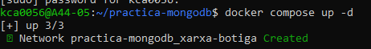
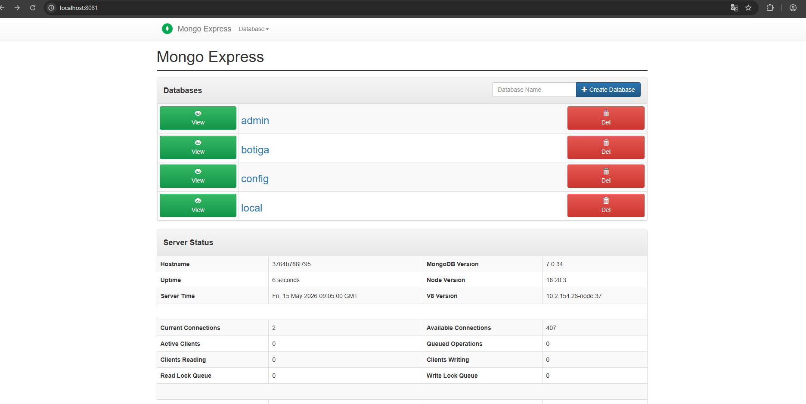
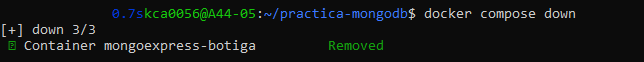
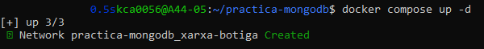
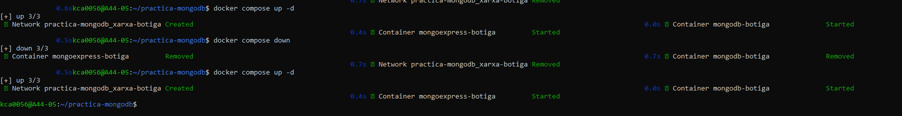
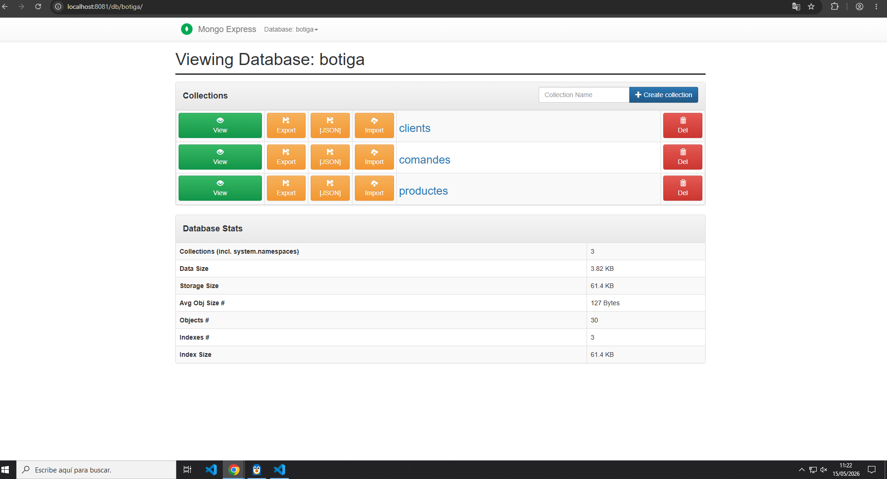

Bloque 1 – Preguntas teóricas
1. Diferencia entre docker run y docker compose up

docker run se utiliza para ejecutar un único contenedor de forma manual, indicando todas sus opciones (imagen, puertos, variables de entorno, etc.).

docker compose up permite ejecutar múltiples contenedores definidos en un archivo docker-compose.yml, gestionando servicios, redes y volúmenes de forma centralizada.

2. Para qué sirve depends_on? Garantiza que el servicio esté operativo?

depends_on define el orden de inicio de los servicios en Docker Compose. Sirve para asegurar que un servicio se inicie antes que otro.

No garantiza que el servicio esté completamente operativo, solo que el contenedor ha arrancado.

Por ejemplo, MongoDB puede estar iniciado pero aún no aceptar conexiones cuando otro servicio intenta conectarse.

3. Diferencia entre red bridge por defecto y red personalizada

La red bridge por defecto es la red automática creada por Docker cuando no se define ninguna red.

Una red personalizada permite:

Definir un nombre propio
Comunicación entre servicios por nombre
Mejor organización y aislamiento

En este proyecto, la red permite que mongodb y mongo-express se comuniquen por nombre de servicio.

Bloque 2 - 
Prova persistencia

compose up -d

db botiga

compose down

compose up

todo junto composes

Preguntes teòriques

1. Què passaria si no definíssim cap volum al docker-compose.yml?

Si no definimos ningún volumen, los datos de MongoDB se almacenan dentro del propio contenedor. Esto significa que cuando el contenedor se elimina o se recrea (docker compose down), toda la información se pierde.

En cambio, con un volumen, los datos se guardan fuera del contenedor y se mantienen aunque este se elimine.

2. Diferència entre volum named i bind mount

Un bind mount utiliza una carpeta del sistema anfitrión (por ejemplo ./data:/data/db). Esto permite ver y modificar directamente los archivos desde el sistema operativo.

Un named volume es gestionado por Docker y no depende de una ruta del host, por lo que está más aislado.

Bind mount: útil en desarrollo porque permite ver los datos fácilmente.
Named volume: más seguro y recomendable en producción porque Docker gestiona el almacenamiento.
3. Diferència entre embedding i referència amb exemples

Embedding consiste en guardar datos dentro del mismo documento.

Ejemplo:
Un pedido que contiene directamente los productos comprados dentro del mismo documento.

Ventajas: consultas más rápidas y simples.
Desventajas: duplicación de datos.

Referencia consiste en guardar los datos en colecciones separadas y relacionarlas mediante un identificador.

Ejemplo:
Un pedido que guarda solo el client_id y los productos se consultan en otra colección.

Ventajas: menos duplicación y mejor escalabilidad.
Desventajas: consultas más complejas usando $lookup.

4. Estratègia utilitzada en la col·lecció comandes

En la colección comandes se ha utilizado principalmente la estrategia de referencia, ya que cada comanda está relacionada con un cliente y productos.

Esto permite evitar duplicar datos de clientes o productos en cada pedido y facilita la escalabilidad del sistema cuando el volumen de datos crece.

PREGUNTES TEORIQUES BLOC 3

Pregunta 1
1. Tal com has creat la col·lecció de productes, el seu nom és únic? Justifica la resposta.

No, el camp nom no és únic.

MongoDB només garanteix que el camp _id sigui únic automàticament.
En la meva col·lecció no he creat cap índex únic sobre el camp nom, així que es podrien inserir diversos productes amb el mateix nom.

Per fer que el nom sigui únic caldria crear un índex únic:

db.productes.createIndex(
  { nom: 1 },
  { unique: true }
)
3.5 Pregunta 2
2. Què significa el terme “projectar” en les consultes?

Projectar significa mostrar només alguns camps concrets dels documents en el resultat d’una consulta.

Això permet:

reduir informació innecessària
millorar el rendiment
retornar només les dades necessàries
Exemple

Mostrar només el nom i la categoria dels productes:

db.productes.find(
  {},
  {
    _id: 0,
    nom: 1,
    categoria: 1
  }
)

En aquest exemple:

1 significa mostrar el camp
0 significa ocultar-lo
3.5 Pregunta 3
3. Funcions i operadors utilitzats
insertOne()

Insereix un únic document a la col·lecció.

Exemple
db.clients.insertOne({
  nom: "Alex",
  ciutat: "Valencia"
})
insertMany()

Insereix diversos documents alhora.

Exemple
db.clients.insertMany([
  { nom: "Marta" },
  { nom: "Pere" }
])
find()

Serveix per consultar documents.

Exemple
db.productes.find({
  categoria: "roba"
})
updateOne()

Actualitza un únic document.

Exemple
db.productes.updateOne(
  { nom: "Monitor LG" },
  {
    $set: {
      preu: 250
    }
  }
)
updateMany()

Actualitza diversos documents.

Exemple
db.productes.updateMany(
  { categoria: "roba" },
  {
    $inc: {
      estoc: 5
    }
  }
)
deleteOne()

Elimina un document.

Exemple
db.productes.deleteOne({
  nom: "Pilota futbol"
})
deleteMany()

Elimina diversos documents.

Exemple
db.productes.deleteMany({
  actiu: false
})
$lt

Selecciona valors menors que un número.

Exemple
{
  preu: { $lt: 100 }
}
$gt

Selecciona valors majors que un número.

Exemple
{
  estoc: { $gt: 20 }
}
$gte

Selecciona valors majors o iguals.

Exemple
{
  valoracio: { $gte: 4.5 }
}
$set

Canvia el valor d’un camp.

Exemple
{
  $set: {
    actiu: false
  }
}
$inc

Incrementa un valor numèric.

Exemple
{
  $inc: {
    estoc: 3
  }
}
$push

Afegeix un element a un array.

Exemple
{
  $push: {
    etiquetes: "nou"
  }
}

PREGUNTAS TEORICAS 1. Índices

Tener demasiados índices puede ser perjudicial porque:

mejoran lecturas (SELECT más rápidos)
pero empeoran escrituras (INSERT/UPDATE más lentos)
ocupan más memoria

Es un trade-off entre rendimiento de lectura y escritura.

2. Operadores usados
$and → todas las condiciones
$or → una u otra condición
$gte → mayor o igual
$lte → menor o igual
$regex → búsqueda de texto
$group → agrupación de datos
$sum → suma
$avg → media
sort() → ordenar
limit() → limitar resultados
createIndex() → crear índice
getIndexes() → ver índices
explain() → analizar rendimiento